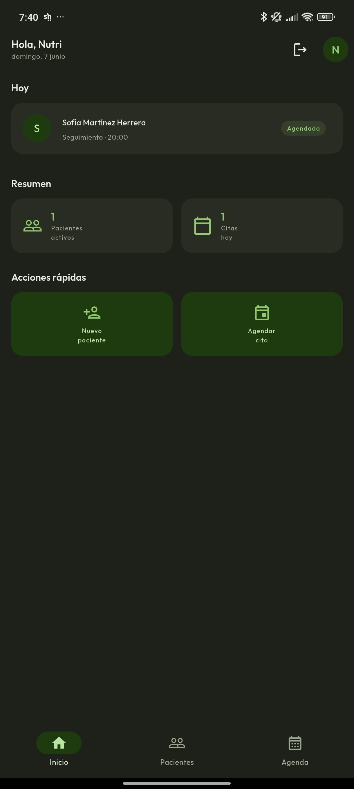
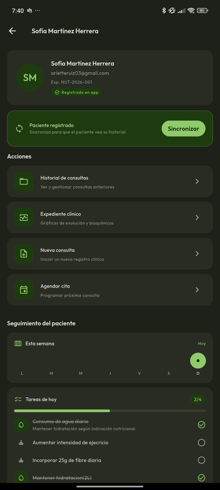
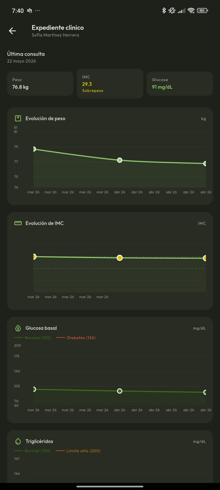
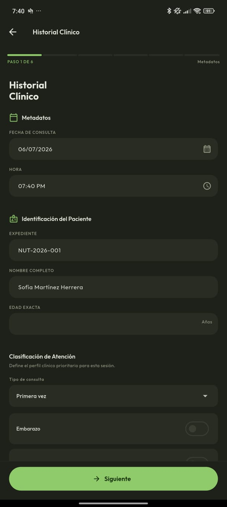
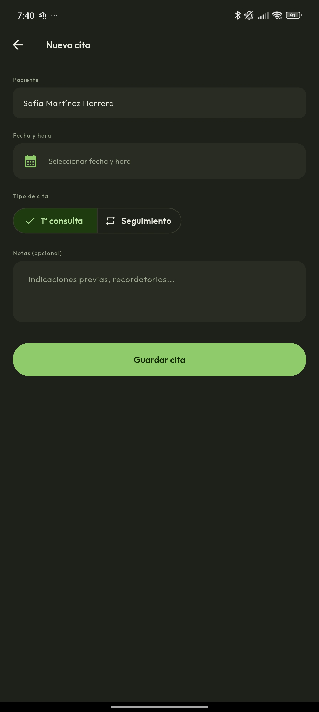
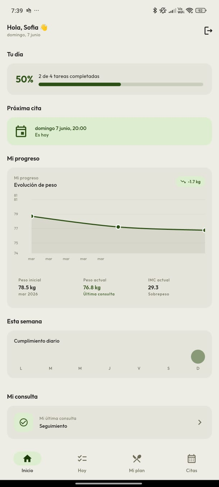
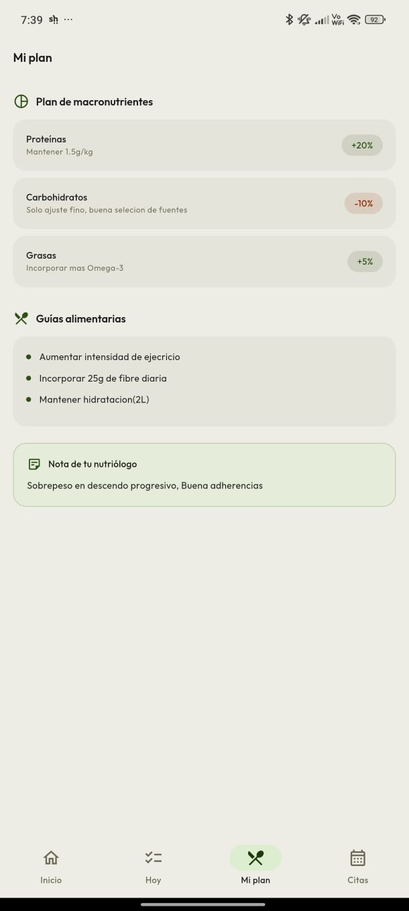
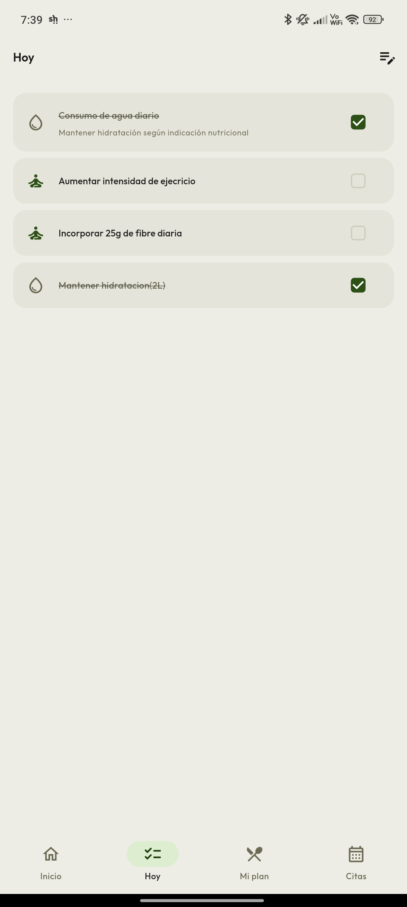

# NutriTrack 🌿

Sistema móvil de expediente clínico nutricional desarrollado con Flutter y Firebase. Permite a nutriólogos gestionar pacientes, realizar consultas estructuradas y hacer seguimiento del tratamiento, mientras los pacientes pueden ver su plan nutricional y registrar su cumplimiento diario.

---

## Capturas de pantalla

### Nutriólogo
| Home | Pacientes | Expediente | Consulta | Agenda |
|:---:|:---:|:---:|:---:|:---:|
|  |  |  |  |  |

### Paciente
| Home | Mi plan | Tareas |
|:---:|:---:|:---:|:---:|
|  |  |  |

## Stack tecnológico

| Tecnología | Versión | Uso |
|---|---|---|
| Flutter | 3.x | Framework UI multiplataforma |
| Dart | 3.x | Lenguaje de programación |
| Riverpod | 3.x (codegen) | Gestión de estado e inyección de dependencias |
| freezed | 2.x | Inmutabilidad para entities, models y states |
| go_router | 17.x | Enrutamiento declarativo con redirección por rol |
| Firebase Auth | 5.x | Autenticación y manejo de roles |
| Cloud Firestore | 5.x | Base de datos NoSQL en tiempo real |
| fl_chart | 0.70.x | Gráficas de evolución clínica |
| flutter_hooks | 0.21.x | Estado local en widgets |

---

## Arquitectura

El proyecto implementa **Clean Architecture** dividida estrictamente por features. El flujo de datos es unidireccional e inquebrantable:

```
Firebase → DataSource → Model → toEntity() → Entity → UseCase → Provider → Widget
```

### Estructura de directorios

```
lib/
├── core/
│   ├── exceptions/       # AppException, FirebaseExceptionMapper
│   ├── router/           # GoRouter, _RouterNotifier
│   └── theme/            # AppTheme, NutriColors, AppTextTheme
│
└── features/
    └── {feature}/
        ├── domain/
        │   ├── entities/       # @freezed, sin imports de Firebase
        │   ├── repositories/   # Contratos abstractos
        │   └── usecases/       # Un caso de uso por responsabilidad
        ├── data/
        │   ├── datasources/    # Comunicación con Firestore
        │   ├── models/         # @freezed + fromFirestore/toFirestore/toEntity
        │   └── repositories/   # Implementaciones concretas
        └── presentation/
            ├── pages/          # Scaffold + .when() para estados async
            ├── widgets/        # Componentes reutilizables
            ├── notifiers/      # AsyncNotifier con lógica de presentación
            ├── providers/      # Wiring de DI con @riverpod
            └── states/         # @freezed para estados complejos
```

### Features principales

| Feature | Responsabilidad |
|---|---|
| `auth` | Autenticación, roles (nutriólogo / paciente), stream de sesión |
| `home` | Dashboards separados por rol |
| `patients` | CRUD de pacientes, vinculación de cuenta, sincronización |
| `consultation` | Wizard de 6 pasos con guardado en borrador |
| `schedule` | Gestión de citas |
| `daily_log` | Bitácora diaria del paciente |
| `recommendations` | Plan nutricional y tasks automáticas |

---

## Funcionalidades

### Nutriólogo
- Registro y login con correo/contraseña
- Gestión de pacientes con alta previa al registro
- Wizard de consulta de 6 pasos (Metadatos, Antropometría, Bioquímicos, Dietética, Recordatorio 24h, Diagnóstico PES)
- Guardado en borrador — continúa la consulta en cualquier momento
- Generación automática de plan nutricional y tareas desde el diagnóstico
- Agenda de citas
- Expediente clínico con gráficas de evolución de peso, IMC, glucosa y triglicéridos
- Seguimiento semanal del cumplimiento del paciente con detalle por día
- Sincronización del historial cuando el paciente crea su cuenta

### Paciente
- Registro vinculado al correo dado de alta por el nutriólogo
- Dashboard con progreso del día, próxima cita y racha semanal
- Checklist de tareas diarias asignadas por el nutriólogo
- Plan nutricional con macros, guías alimentarias, hábitos y metas
- Gráfica de evolución de peso entre consultas
- Historial de consultas (sin datos bioquímicos)

---

## Modelo de datos (Firestore)

| Colección | Descripción |
|---|---|
| `users/{uid}` | Role, email, displayName |
| `patients/{docId}` | Datos del paciente, uid de Auth, nutriologistId |
| `patient_links/{emailKey}` | Vinculación de correo antes del registro |
| `consultations/{id}` | Consulta con status y steps subcollección |
| `consultations/{id}/steps/{stepN}` | Datos de cada paso del wizard |
| `appointments/{id}` | Citas con fecha, tipo y estado |
| `recommendations/{id}` | Plan nutricional generado desde diagnóstico |
| `daily_logs/{uid}/entries/{date}` | Bitácora diaria del paciente |
| `tasks/{uid}/items/{taskId}` | Tareas asignadas por el nutriólogo |

### patientId vs patientUid

> Concepto clave del modelo de datos

- **`patientId`** — ID del documento en `patients/`. Existe desde que el nutriólogo crea al paciente.
- **`patientUid`** — UID de Firebase Auth. Solo existe después de que el paciente se registra en la app.

---

## Requisitos previos

- Flutter SDK 3.x
- Dart SDK 3.x
- Cuenta de Firebase con proyecto configurado
- `google-services.json` en `android/app/`

---

## Instalación

```bash
# Clonar el repositorio
git clone https://github.com/tu-usuario/nutritrack.git
cd nutritrack

# Instalar dependencias
flutter pub get

# Generar código de Riverpod y Freezed
dart run build_runner build --delete-conflicting-outputs

# Correr en modo debug
flutter run
```

---

## Build

```bash
# APK de debug
flutter build apk --debug

# APK de release
flutter build apk --release
```

El APK queda en `build/app/outputs/flutter-apk/`.

---

## Reglas de negocio

| Regla | Descripción |
|---|---|
| RN-01 | Un paciente solo puede estar asignado a un nutriólogo |
| RN-02 | El paciente debe registrarse con el mismo correo que el nutriólogo registró |
| RN-03 | La consulta no se crea en Firestore hasta que el nutriólogo avanza el primer paso |
| RN-04 | Los datos bioquímicos solo son visibles para el nutriólogo |
| RN-05 | El plan nutricional solo puede generarse o regenerarse por el nutriólogo |
| RN-06 | El nutriólogo debe sincronizar para que el paciente vea su historial anterior |

---

## Guía para agregar un nuevo feature

1. Crear estructura de carpetas `domain/`, `data/`, `presentation/`
2. Definir el **Entity** — `@freezed`, sin imports de Firebase
3. Definir el **contrato** en `repositories/` — interfaz abstracta
4. Crear el **Use Case** — una clase por responsabilidad
5. Crear el **Model** — `@freezed` con `fromFirestore`, `toFirestore`, `toEntity`
6. Implementar el **DataSource** — comunicación con Firestore
7. Implementar el **Repository** — convierte Models a Entities
8. Crear los **Providers** — wiring de DI con `@riverpod`
9. Ejecutar `dart run build_runner build --delete-conflicting-outputs`
10. Implementar **Notifiers**, **Pages** y **Widgets**

### Reglas de oro

- **NUNCA** importar Firebase en `domain/`
- **NUNCA** usar `FirebaseFirestore.instance` directamente en `presentation/`
- **SIEMPRE** convertir Model → Entity antes de exponerlo hacia presentation
- **NUNCA** hacer `context.go()` después de login/registro — el router lo maneja solo

---

## Autores

- Arlette Carolina Ruiz Rosales
- César Isaac Orozco Álvarez

Universidad Autónoma del Estado de México — Facultad de Ingeniería — 2026
